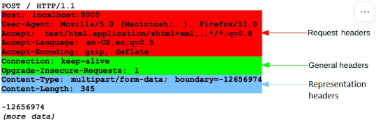
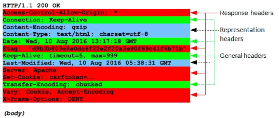

# HTTP(HyperText Transfer Protocol)
- **What?** 파일이나 문서들이 링크를 통해 서로 연결되어 있는 **구조화된 텍스트**(html, css, js, png, jpeg)를 전송하기 위해 사용되는 통신 규약
- **Why?** 웹 서버와 클라이언트 간의 **표준화 된 문서 전송**을 위해
- **How?** 클라이언트가 **URL**을 통해 특정 웹 주소로 요청을 보냄

### HTTP Message
- client-server 간 파일 전달 통신의 기본 단위
  - Start Line: Request, Response의 status
  - HTTP Headers: Message Body를 요약하는 header들의 집합
  - Empty Line: Header와 본문을 구분하기 위한 빈 줄
  - Body: 실제 내용(HTML, JSON)
- HTTP Request
    
- HTTP Response
    

※ FastAPI 에서는?
- **Pydantic Model**(Request Body의 데이터 구조와 타입을 정의하는 DTO 역할)을 사용하여 요청으로 전달된 데이터를 해당 모델로 변환하는 과정에서 자동으로 Request Body 유효성 검사를 수행

### Streaming
- 한번에 완성된 응답을 주는 대신, 조금씩 흘려주는 기능

### Context Manager
- 리소스의 할당과 해제를 자동으로 처리해주는 객체
- e.g., with open('file.txt', 'w') as f:

### 예외 처리
- 응답 200이 아닌 경우에 대한 대처

### try catch